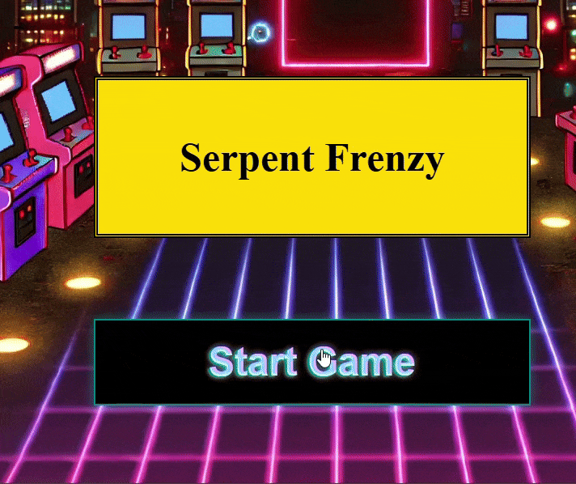

# 🐍 Snake Game

An interactive **JavaScript Snake Game** built from scratch using **HTML5 Canvas**, **CSS3
animations**, and **modular JavaScript**.  
Designed to demonstrate strong front-end engineering, DOM manipulation, and state-driven UI
transitions — from landing page animation to in-game rendering.

---

## 🎮 Live Demo

▶️ **Play Online:** 
[Live Demo on netlify](https://jasnakegame.netlify.app/)

🖼️ **Preview Screenshot:**  


---

## 🧠 Project Overview

This project re-imagines the classic Snake game with a polished UI and modular codebase.  
Users start on a custom landing page that transitions into an arcade-style interface using visual
effects like flashing, shaking, and fade-outs handled by `page.js`.

Once inside the arcade screen, the core gameplay — written entirely in vanilla JavaScript — takes
over, using canvas rendering for fluid real-time movement and collision detection.

---

## ⚙️ Features

### 🎨 UI / UX

- Interactive **landing screen** with:
  - Flash + shake intro sequence
  - Smooth fade transition into the game canvas
- **Arcade-style layout** with score and level indicators
- **Keyboard controls** (arrow keys) for movement
- Modular design separating:
  - `page.js` → UI transitions and injection
  - `game.js` → Core gameplay logic

### 🧩 Gameplay

- Classic snake growth and movement
- Randomized food placement with grid alignment
- Collision detection with walls and self
- Leveling and score tracking
- Progressive speed increase per level
- Game over detection and restart capability

### 🧱 Technical Highlights

- Written in **plain JavaScript (ES6)** — no external frameworks
- Uses **HTML5 Canvas API** for rendering
- **Event-driven state machine** design for game transitions
- **Reusable UI logic** for DOM manipulation and injection
- **Custom animations** (flash invert, shake, fade) in pure CSS

---

## 🧠 Architecture

```text
Snake_Game/
│
├── index.html          # Landing structure & script includes
├── style.css           # Layout, animations, and visual styling
├── page.js             # Handles page transitions & game injection
├── game.js             # Core snake logic and rendering loop
├── arcback4.png        # Arcade background
└── README.md           # Project documentation
```

### Script Responsibilities

| Script         | Role                                                           |
| -------------- | -------------------------------------------------------------- |
| **index.html** | Entry point with initial UI and script hooks                   |
| **page.js**    | Controls UI transition, DOM injection, and animation sequences |
| **game.js**    | Implements game logic, rendering, movement, and scoring        |
| **style.css**  | Manages layout, animations, and visual transitions             |

---

## 💻 How to Run Locally

```bash
# Clone the repository
git clone https://github.com/JorgeSoftwareDev/Snake_Game.git
cd Snake_Game

# Open the project
# Simply open index.html in your preferred browser
```

> ⚠️ No dependencies or build tools required.  
> Works on any modern browser that supports HTML5 Canvas.

---

## 🧩 Core Code Example

Example of movement logic from `game.js`:

```js
function advanceSnake() {
  const head = { x: snake[0].x + dx, y: snake[0].y + dy };
  snake.unshift(head);

  const didEatFood = snake[0].x === foodX && snake[0].y === foodY;

  if (didEatFood) {
    createFood();
    updateScore();
  } else {
    snake.pop();
  }
}
```

---

## 🧭 Roadmap

Planned Enhancements:

- [ ] Add **Start / Restart buttons** inside the arcade view
- [ ] Add **sound effects** for movement, eating, and game over
- [ ] Add **localStorage high score tracking**
- [ ] Add **touch controls** for mobile play
- [ ] Integrate **pause / resume functionality**

---

## 🧰 Tech Stack

| Category         | Technologies                                 |
| ---------------- | -------------------------------------------- |
| **Languages**    | JavaScript (ES6), HTML5, CSS3                |
| **Tools**        | VS Code, Git, GitHub                         |
| **Core APIs**    | Canvas API, DOM API                          |
| **Design Focus** | Animation, UX transitions, modular structure |

---

## 🧑‍💻 Developer Notes

This project showcases:

- Strong understanding of front-end **state management without frameworks**
- Use of **modern ES6 syntax** and **clean modular architecture**
- Skill in **CSS animations and DOM-based transitions**
- Implementation of **interactive and reactive UI behaviors**

Built and maintained by **Jorge Alvarado**

---

## 🧑‍💻 About the Developer

**Jorge Alvarado**  
Full Stack Developer | IT Professional | AI/Automation Enthusiast

> “Transforming ideas into scalable, user-centric applications.”

- 🌐 [GitHub Portfolio](https://github.com/JorgeSoftwareDev)
- 💼 [LinkedIn](https://www.linkedin.com/in/jorgesoftwardev/)
- 📧 [Email](mailto:jorgesoftwaredev@gmail.com)

---

## 🪄 License

This project is licensed under the **MIT License** — feel free to use, modify, and distribute with
attribution.

---

### ⭐ If you enjoyed this project, please consider giving it a star on GitHub!
